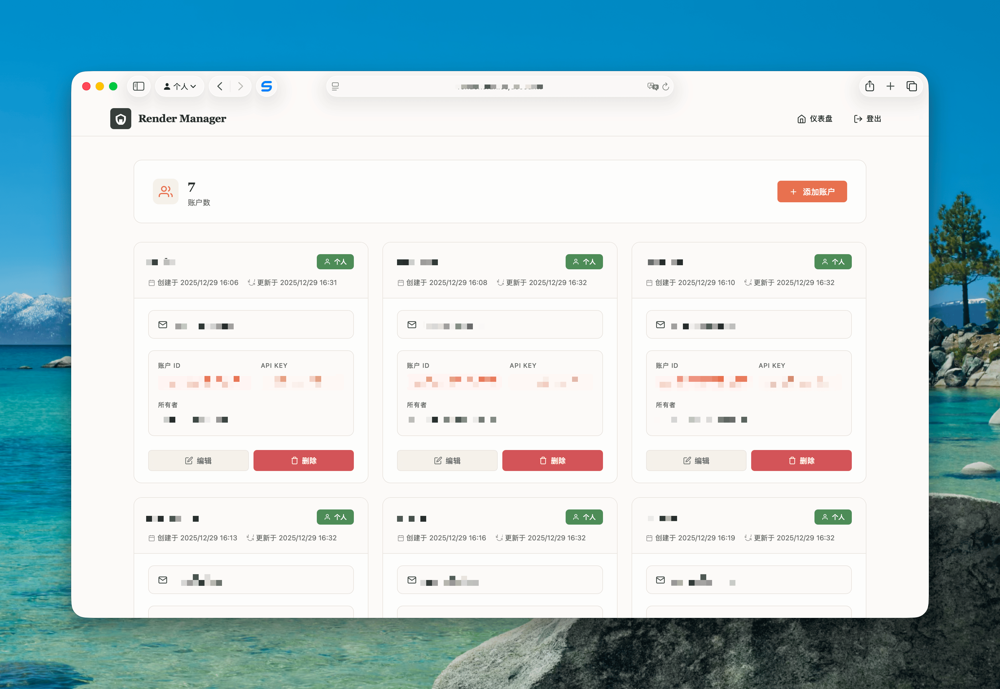

## Render 服务管理系统

[](https://opensource.org/licenses/MIT)
[](https://github.com/ssfun/render-service-manager/graphs/commit-activity)

一个现代化的 Render 服务管理面板，让你能够集中管理多个 Render 账户中的 WEB_SERVICE 服务。提供账户管理、服务监控、部署控制、环境变量管理、日志查看和实例管理等完整功能。




## 💡 特性

### 👥 账户管理
- 通过 Web 界面动态添加、编辑、删除 Render 账户
- API Key 添加前自动验证有效性
- 账户信息安全存储在 Cloudflare KV 中
- API Key 仅显示预览（前8位...后4位）

### 🛡️ 安全登录
- 提供密码保护的登录页面
- 基于 Cookie 的会话管理（24小时过期，滑动刷新）
- CSRF Token 双提交 Cookie 模式保护
- IP + 用户名双重登录失败锁定（指数退避）
- 时序安全的密码比较（防止时序攻击）
- HSTS 安全头强制 HTTPS
- 登录状态持久化

### 📊 服务监控面板
- 实时显示服务状态（运行中/已暂停）
- 服务统计信息（总数、运行中数量、账户数）
- 服务搜索和账户过滤功能
- 智能缓存机制（15分钟新鲜/24小时过期）
- 手动刷新按钮和缓存时间显示

### 🚀 部署管理
- 一键触发部署
- 查看部署历史记录
- 取消进行中的部署
- 回滚到历史版本

### ⚙️ 服务控制
- 暂停/恢复服务
- 重启服务
- 服务状态实时更新

### 🔧 环境变量管理
- 查看所有环境变量
- 在线编辑环境变量值
- 添加新的环境变量
- 删除现有环境变量
- 值的复制功能

### 📝 日志与监控
- 查看服务运行日志
- 日志级别筛选（error/warn/info/debug）
- 终端风格深色主题日志查看器
- 查看服务实例状态
- 扩缩容服务实例

### 📋 事件日志
- 查看最近事件日志
- 显示部署开始/结束状态
- 部署成功/失败状态标识
- 显示触发原因和用户信息

### 🎨 现代化 UI
- 响应式设计，支持移动端
- 漂亮的卡片式布局
- 流畅的交互动画
- 一致的设计风格

### ⏰ 自动保活（Cron）
- 定时 Ping 所有运行中的 Web 服务
- 并发批处理（每批10个服务）
- 指数退避重试机制
- 智能利用缓存减少 API 调用

## 🚀 快速开始

点击下方按钮快速部署：

[](https://deploy.workers.cloudflare.com/?url=https://github.com/ssfun/render-service-manager)

### 方式 1: 通过 Wrangler CLI 部署（推荐）

1. **克隆仓库**：
   ```bash
   git clone https://github.com/ssfun/render-service-manager.git
   cd render-service-manager
   ```

2. **安装 Wrangler CLI**：
   ```bash
   npm install -g wrangler
   ```

3. **创建 KV 命名空间**：
   ```bash
   npx wrangler kv:namespace create RENDER_KV
   ```
   将返回的 ID 复制备用。

4. **配置 wrangler.toml**：
   编辑 `wrangler.toml` 文件：
   ```toml
   name = "render-service-manager"
   main = "src/index.js"
   compatibility_date = "2025-10-01"

   [observability]
   enabled = true

   [[kv_namespaces]]
   binding = "RENDER_KV"
   id = "你的KV_ID"  # 替换为上一步获取的 ID

   [triggers]
   crons = ["*/5 * * * *"]  # 每5分钟执行一次保活任务

   [vars]
   ADMIN_USERNAME = "admin"
   ADMIN_PASSWORD = "your-strong-password"  # 请修改为强密码
   ```

5. **登录并部署**：
   ```bash
   npx wrangler login
   npx wrangler deploy
   ```

6. **添加 Render 账户**：
   - 访问部署后的 URL
   - 使用配置的用户名密码登录
   - 点击右上角"账户管理"
   - 点击"添加账户"，输入名称和 Render API Key

### 方式 2: 手动部署（无需 Wrangler CLI）

1. **登录 Cloudflare 账户**：
   - 访问 [Cloudflare Dashboard](https://dash.cloudflare.com/) 并登录。

2. **创建 KV 命名空间**：
   - 导航到 "Workers" > "KV"。
   - 点击 "Create a namespace"。
   - 输入名称（如 "RENDER_KV"），复制生成的 ID 备用。

3. **创建 Worker**：
   - 导航到 "Workers" > "Overview"。
   - 点击 "Create a Worker"。
   - 输入 Worker 名称（如 "render-service-manager"）。

4. **上传代码**：
   - 在 Worker 编辑器中，上传本项目的源代码。

5. **配置环境变量**：
   - 点击 "Settings" > "Variables"。
   - 添加以下环境变量：
     | 变量名 | 值 |
     |--------|------|
     | `ADMIN_USERNAME` | admin |
     | `ADMIN_PASSWORD` | your-strong-password |

6. **绑定 KV 命名空间**：
   - 在 "Settings" > "Bindings" > "KV Namespace Bindings" 部分。
   - 点击 "Add binding"。
   - 变量名称输入 `RENDER_KV`。
   - 选择步骤 2 中创建的 KV 命名空间。

7. **部署 Worker**：
   - 点击 "Save and Deploy"。
   - 通过提供的 URL 访问（例如: render-service-manager.your-subdomain.workers.dev）。

8. **添加 Render 账户**：
   - 登录后点击"账户管理"添加你的 Render 账户。

## 📁 项目结构

```
src/
├── index.js                 # 主入口和路由配置
├── config/
│   └── constants.js         # 常量配置
├── handlers/
│   ├── accounts.js          # 账户管理处理器
│   ├── auth.js              # 认证处理器
│   ├── cron.js              # Cron 保活任务处理器
│   ├── envVars.js           # 环境变量处理器
│   ├── events.js            # 事件日志处理器
│   ├── monitoring.js        # 监控处理器（日志、实例、扩缩容）
│   ├── pages.js             # 页面渲染处理器
│   ├── serviceControl.js    # 服务控制处理器
│   └── services.js          # 服务列表处理器
├── services/
│   ├── cache.js             # 缓存服务（软/硬 TTL）
│   ├── renderApi.js         # Render API 封装
│   └── session.js           # 会话管理
├── utils/
│   ├── helpers.js           # 辅助函数
│   └── response.js          # HTTP 响应工具
└── views/
    ├── accounts.js          # 账户管理页面
    ├── dashboard.js         # 仪表盘页面
    ├── dashboardScript.js   # 仪表盘前端脚本
    ├── login.js             # 登录页面
    ├── sharedScript.js      # 共享前端脚本
    └── styles.js            # 样式定义
```

## 🔑 环境变量

| 变量名 | 说明 | 必填 |
|--------|------|------|
| `ADMIN_USERNAME` | 管理员登录用户名 | ✅ |
| `ADMIN_PASSWORD` | 管理员登录密码 | ✅ |

## 📡 API 路由

### 认证
| 路由 | 方法 | 说明 |
|------|------|------|
| `/login` | GET | 登录页面 |
| `/login` | POST | 登录认证 |
| `/logout` | POST | 登出 |

### 账户管理
| 路由 | 方法 | 说明 |
|------|------|------|
| `/accounts` | GET | 账户管理页面 |
| `/api/accounts` | GET | 获取账户列表 |
| `/api/accounts` | POST | 添加账户 |
| `/api/accounts/test` | POST | 测试 API Key |
| `/api/accounts/{id}` | PUT | 更新账户 |
| `/api/accounts/{id}` | DELETE | 删除账户 |

### 服务管理
| 路由 | 方法 | 说明 |
|------|------|------|
| `/api/services` | GET | 获取所有服务（支持 ?refresh=true 强制刷新） |
| `/api/services/{accountId}/{serviceId}` | GET | 获取服务详情 |
| `/api/services/{accountId}/{serviceId}/suspend` | POST | 暂停服务 |
| `/api/services/{accountId}/{serviceId}/resume` | POST | 恢复服务 |
| `/api/services/{accountId}/{serviceId}/restart` | POST | 重启服务 |
| `/api/services/{accountId}/{serviceId}/scale` | POST | 扩缩容服务 |

### 部署管理
| 路由 | 方法 | 说明 |
|------|------|------|
| `/api/deploy` | POST | 触发部署 |
| `/api/deploys/{accountId}/{serviceId}` | GET | 获取部署历史 |
| `/api/deploys/{accountId}/{deployId}/cancel` | POST | 取消部署 |
| `/api/deploys/{accountId}/{deployId}/rollback` | POST | 回滚部署 |

### 监控
| 路由 | 方法 | 说明 |
|------|------|------|
| `/api/logs/{accountId}/{serviceId}` | GET | 获取服务日志 |
| `/api/instances/{accountId}/{serviceId}` | GET | 获取服务实例 |
| `/api/events/{accountId}/{serviceId}` | GET | 获取事件日志 |

### 环境变量
| 路由 | 方法 | 说明 |
|------|------|------|
| `/api/env-vars/{accountId}/{serviceId}` | GET | 获取环境变量 |
| `/api/env-vars/{accountId}/{serviceId}` | PUT | 批量更新环境变量 |
| `/api/env-vars/{accountId}/{serviceId}/{key}` | PUT | 更新单个环境变量 |
| `/api/env-vars/{accountId}/{serviceId}/{key}` | DELETE | 删除环境变量 |

## 🛡️ 安全说明

- 所有 API 请求都需要登录认证
- 会话数据存储在 Cloudflare KV 中，24小时过期，支持滑动刷新
- CSRF Token 双提交 Cookie 模式保护写操作
- 时序安全的密码比较，防止时序攻击
- IP + 用户名双重登录失败锁定，使用指数退避
- API Key 安全存储在 KV 中，前端仅显示预览（前8位...后4位）
- 添加账户时强制验证 API Key 有效性
- HSTS 安全头强制使用 HTTPS
- 使用 HTTPS 加密传输

## 🔄 缓存机制

服务列表数据采用智能缓存策略：

| 缓存状态 | 时间范围 | 行为 |
|----------|----------|------|
| Fresh | 0-15 分钟 | 直接使用缓存 |
| Stale | 15分钟-24小时 | 使用缓存 + 后台刷新 |
| Expired | >24 小时 | 同步刷新 |

- 缓存带版本号，数据结构变更时自动失效旧缓存
- 点击刷新按钮可强制刷新数据
- 服务操作（暂停/恢复/重启/部署等）会自动失效对应账户的缓存
- KV 存储 TTL 为 48 小时

## 🙏 致谢

- [Render](https://render.com) - 提供优秀的部署平台
- [Cloudflare Workers](https://workers.cloudflare.com) - 提供无服务器计算平台
- [Koyeb Manager](https://github.com/ssfun/koyeb-manager) - 项目架构参考

## 📄 许可证

本项目采用 [MIT 许可证](LICENSE). 版权所有 © 2025 [sfun](https://github.com/ssfun)
